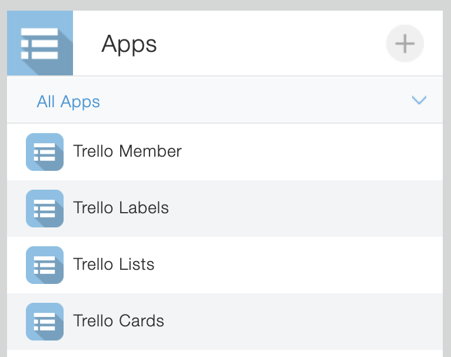

# trekin-sample
[](https://app.fossa.com/projects/git%2Bgithub.com%2Fkorosuke613%2Ftrekin-sample?ref=badge_shield)


## Setup
### Install kintone apps
#### create kintone app template(zip)
```
cd kintoneAppsTemplate
./zippingTrekinAppTemplate.sh
```

`TrekinKintoneAppsTemplate.zip` is generated.

#### import template
[Creating an App by Importing a Template File](https://get.kintone.help/k/en/user/create_app/app_csv/add_app_template_file.html)



### Generate API tokens
WIP

### Register webhook 

```
curl -X GET --url "https://api.trello.com/1/members/me/boards/?token=$TRELLO_API_TOKEN&key=$TRELLO_API_KEY" | jq
```
`.id`: $TRELLO_BOARD_ID_MODEL

```
curl -X POST -H "Content-Type: application/json" \
https://api.trello.com/1/tokens/$TRELLO_API_TOKEN/webhooks/ -d @- << EOS
{
  "key": "$TRELLO_API_KEY",
  "callbackURL": "$AWS_API_GATEWAY_ENDPOINT",
  "idModel":"$TRELLO_BOARD_ID_MODEL",
  "description": "Trekin"
}
EOS
```

`.id`: $WEBHOOK_ID

```
curl --request DELETE --url "https://api.trello.com/1/webhooks/$WEBHOOK_ID?key=$TRELLO_API_KEY&token=$TRELLO_API_TOKEN"
```


## License
[](https://app.fossa.com/projects/git%2Bgithub.com%2Fkorosuke613%2Ftrekin-sample?ref=badge_large)